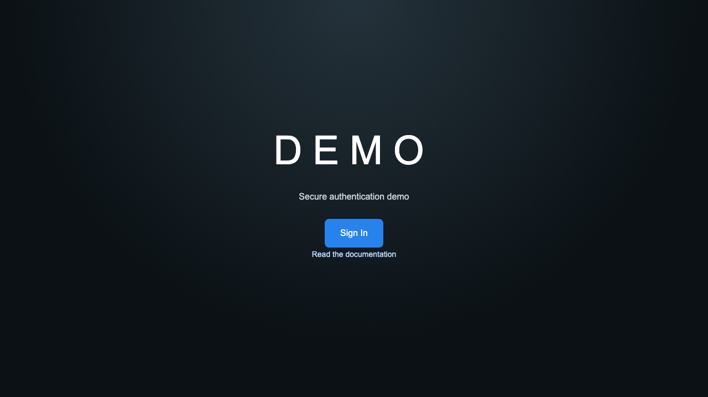

# Next.js Auth Demo

A security-focused email/password authentication example showing signup,
profile completion, session handling, and server-side dashboard protection.



## What it demonstrates

- Separate sign-in and profile-completion flows.
- Argon2id password hashing and opaque session cookies.
- Short-lived onboarding authorization for incomplete profiles.
- Server-side authorization, same-origin API checks, validation, and rate
  limiting.

## Authentication flow

1. A visitor submits an email address.
2. The application chooses the sign-in or sign-up path and validates input.
3. Passwords are hashed or verified, and incomplete profiles enter onboarding.
4. The server issues the appropriate onboarding or normal session.
5. Server-side authorization protects the dashboard and profile actions.

This demonstrates secure application boundaries, session lifecycle design,
onboarding authorization, and server-side access control rather than AI.

## Technology used

- **Next.js App Router / React** — render routes, forms, and protected pages.
- **TypeScript / Zod** — define and validate application input boundaries.
- **Prisma / PostgreSQL** — persist users, sessions, and onboarding state.
- **Argon2id** — hash and verify passwords securely.
- **Tailwind CSS** — style the responsive demo interface.
- **Vitest / Playwright** — verify unit, integration, and browser behavior.

## Quick start

```bash
cp .env.example .env
docker compose up -d
npm install
npx prisma migrate dev
npm run db:seed
npm run dev
```

Open <http://localhost:3000>. The seeded demo accounts and passwords are
documented in the development guide.

## Further reading

- [Development workflows](docs/development-workflows.md)
- [Authentication flow](docs/auth-flow.md)
- [Security notes](docs/security.md)
- [Repository file guide](docs/file-guide.md)
